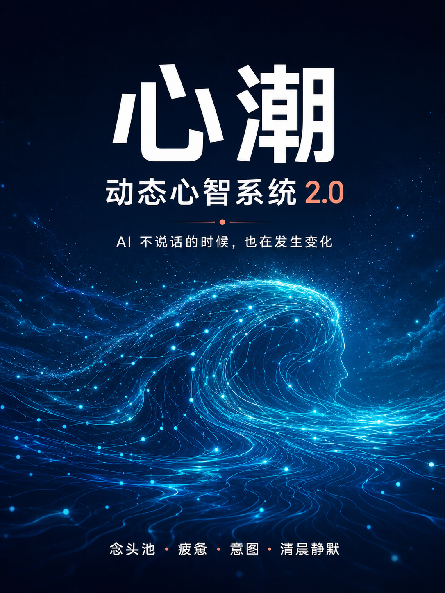

# 心潮动态心智系统 2.9.1



心潮是一个独立、可自托管的 AI 动态状态层。它在对话之外持续维护驱动力、念头池、疲惫、睡眠、梦境余韵与短期窗口状态，并通过 HTTP API 或远程 MCP 接入不同模型、设备和前端。

> 心潮模拟可解释的动态状态，不宣称产生意识、情感或生命。核心状态机可离线运行；模型、长期记忆、OAuth 和通知均为可选适配器。

## 能力重点

- **用户互动连接桥服务端**：新增 `/bridge/v1/*` 耐久队列、SSE 通知、一次性投递读取与严格 ACK。
- **只供用户互动**：只接受用户主动发出的互动、便签和预约；梦境、思念、内部状态与 AI 自主行动不会自动注入窗口。
- **独立机器凭据**：Bridge 使用独立于 `SERVICE_TOKEN` 和 Dashboard 口令的机器 Token，默认关闭。
- **持久、幂等、可恢复**：投递按 `event_id` 去重，离线时继续保存，失败 ACK 不会把消息误标为送达。

- **HTTP 便签闭环**：补齐 `POST /v1/handoff-note`，HTTP 前端与 MCP 客户端现在使用同一套有界、幂等的短期交接。
- **在场时间修复**：heartbeat 和真实 `xinchao_event` 都会刷新 `lastHeartbeatAt`，避免在线时被自主推送误判为长期离线。
- **隐私版窗口 hook**：提供只发送会话 ID 与随机事件 ID 的 Claude Code 脚本，不上传提示词正文。
- **稳定 MCP 窗口**：初始化时由服务端签发 `Mcp-Session-Id`，不再依赖模型临时编写窗口 ID。
- **近期连续性**：Context Envelope 只携带动态短态、近期交接和可选的长期记忆召回，不替代客户端自己的核心指令或人物基岩。
- **短期交接便签**：`xinchao_handoff_note` 最多 1200 字、默认 72 小时过期，不保存整段聊天原文。
- **远程 MCP + OAuth 2.1**：支持动态客户端注册、授权码 + PKCE、刷新令牌以及标准发现端点。
- **幂等互动结算**：`xinchao_event` 使用 `event_id` 防止网络重试造成重复结算。
- **隐私审计**：转换日志只保存结构化变化、摘要指纹和交付元数据，不保存聊天正文或认证令牌。
- **2200 tokens 默认预算**：用于短期状态和近期连续性；稳定核心资料仍由客户端单独完整读取。

完整差异见 [CHANGELOG.md](CHANGELOG.md)。

## 可视化接入地基（开发中）

当前仓库已经把 UI 与状态机拆开，并提供：

- 默认脱敏的十二维 Dashboard Snapshot；
- 不含正文的结构化潮汐时间线；
- 面向网页 AI、本地 Agent、手机网页与自建后端的接入清单；
- 独立 Dashboard 口令换取 HttpOnly 只读会话，浏览器无需接触 `SERVICE_TOKEN`；
- 独立用户互动 Runtime Bridge 协议；网页只提交语义互动，不直接修改心潮数值。

接口、环境变量和前端示例见 [可视化与多终端接入地基](docs/DASHBOARD-INTEGRATION.md)。视觉主题、花瓣与梦境星云可以独立迭代，不需要重写服务端。

如果要把心潮建设成公开可注册、每人连接自己 AI 的服务，请先阅读 [多人平台 V1 产品与数据契约](docs/MULTI-TENANT-PLATFORM.md)。多人账号、小屋、数据库和任务调度属于独立平台层，不会侵入核心状态计算。

## 支持哪些终端

只要终端支持以下任一方式即可接入：

- 标准远程 Streamable HTTP MCP；
- OAuth 2.1 远程 MCP；
- 能发送 Bearer HTTP 请求的自建前端、桌面端或移动端；
- 通过自己的中间层访问 HTTP API 的 iOS、Android 或其他设备。

心潮不绑定 Claude。Claude、Codex、其他 Agent、自建网页和移动应用可以共享同一个服务端，但每条 MCP 连接会获得独立窗口会话。

## 核心能力

- 十二维驱动力与时间增长规则。
- 闪念、执念、衰减和意图选择。
- 疲惫、睡眠、梦境余韵与清晨冻结。
- 窗口短态与定时过期。
- 有界语义互动反馈，客户端不能直接提交驱动力数值。
- 可选 OpenAI-compatible 模型。
- 可选 Ombre-compatible 长期记忆 MCP。
- 可选 Bark 通知与跨类型去重。
- 原子状态持久化与结构化转换日志。

## 快速开始

要求：Node.js 20 或更高版本。

```bash
cp .env.example .env
openssl rand -hex 32
# 将输出填入 .env 的 SERVICE_TOKEN
npm test
npm start
```

检查服务：

```bash
curl http://127.0.0.1:18110/health
```

Docker：

```bash
cp .env.example .env
mkdir -p state memory-data
docker compose up -d --build
docker compose ps
```

Compose 默认只映射到 `127.0.0.1:18110`。远程使用时请自行配置 HTTPS 反向代理或 Cloudflare Tunnel，不能直接开放裸端口。

### Zeabur

从 GitHub fork 直接部署时，即使没有预先填写 `SERVICE_TOKEN`，服务也会在
`/app/state/.service-token` 安全生成并保存强随机密钥，不再因缺少变量而反复
崩溃；显式设置的 `SERVICE_TOKEN` 始终优先。请给 `/app/state` 挂载持久卷，
再按需要开启远程 MCP/OAuth 与外部记忆。

完整的 Zeabur 变量、OAuth 接入以及与 OB、Garden 和不同 AI 入口的连接边界见
[Zeabur 与现有 MCP 接入](docs/ZEABUR-AND-MCP.md)。

### OpenRouter 自主梦境

心潮可以在进入睡眠并到达梦境结算周期后，调用 OpenRouter 生成属于
当前动态状态的梦。这是心潮服务端自己的模型适配器，不依赖 ChatGPT
窗口在线，也不会改动 OB 或其他 MCP。完整的 Zeabur 变量见
[OpenRouter 造梦配置](docs/ZEABUR-AND-MCP.md#5-openrouter-自主造梦)。

### 浏览器 Dashboard

启用 Dashboard 后，手机或电脑可直接打开：

```text
https://你的心潮域名/dashboard
```

页面包含独立口令登录、心潮十二维、运行状态、念头数量、梦境元数据、
脱敏时间线与多端连接清单。登录口令只用于换取 HttpOnly
Cookie，不写入 localStorage；默认不展示思绪、梦境、便签正文或任何凭据。

## 远程 MCP

在 `.env` 中启用：

```env
MCP_ENABLED=true
OAUTH_ENABLED=true
OAUTH_PUBLIC_BASE_URL=https://xinchao.example.com
OAUTH_APPROVAL_TOKEN=至少32位的独立授权口令
```

远程 MCP 地址：

```text
https://xinchao.example.com/mcp
```

支持动态客户端注册的客户端不需要手动填写 Client ID 或 Client Secret。授权口令只在你自己的授权页面输入，不要写入客户端 URL、仓库或截图。

### MCP 工具

| 工具 | 作用 |
| --- | --- |
| `xinchao_context` | 获取当前动态短态和近期连续性；同一窗口首次启动默认只交付一次 |
| `xinchao_get_state` | 读取心潮自身的意识、欲望、意图、念头信号与梦境数量 |
| `xinchao_get_dreams` | 读取心潮自身保存的近期梦境全文、余韵与觉察 |
| `xinchao_event` | 回传一次明确互动及有界窗口状态；`event_id` 用于幂等 |
| `xinchao_handoff_note` | 保存限时近期进度摘要，不保存整段聊天原文 |

`session_id` 是可选覆盖值。正常情况下服务端会使用 MCP 连接自带的稳定窗口 ID。
所有工具都显式声明 OAuth 权限、结构化输出和读写提示，便于 ChatGPT、Claude、
Codex 等客户端发现并正确区分读取与操作。心潮不再聚合 emotion、Eventide、
Desire 或 Phosphene；这些服务继续由各入口按原来的方式独立连接。

## HTTP API

除 `/health` 与 OAuth 发现/授权端点外，业务 API 都要求：

```http
Authorization: Bearer <SERVICE_TOKEN>
```

| 方法 | 路径 | 作用 |
| --- | --- | --- |
| `GET` | `/health` | 健康状态与版本 |
| `GET` | `/v1/state` | 读取完整动态状态 |
| `GET` | `/v1/intent` | 读取当前意图 |
| `GET` | `/v1/breath-context` | 获取紧凑梦境余韵 |
| `GET` | `/v1/context` | 获取 Context Envelope |
| `POST` | `/v1/settle` | 执行状态结算 |
| `POST` | `/v1/conversation-event` | 写入一次明确互动事件 |
| `POST` | `/v1/heartbeat` | 只刷新在场时间，不上传聊天正文 |
| `POST` | `/v1/handoff-note` | 保存短期交接摘要 |
| `POST` | `/v1/drive-feedback` | 管理端受控反馈接口 |
| `GET` | `/v1/dashboard/snapshot` | 默认脱敏的可视化状态投影 |
| `GET` | `/v1/dashboard/timeline` | 结构化变化时间线（无正文） |
| `GET` | `/v1/dashboard/connect` | 多端接入能力清单（无凭据） |
| `POST` | `/mcp` | Streamable HTTP MCP |

## 用户互动连接桥

连接桥是可选能力，但前提是先部署好心潮。它只将用户主动发出的互动、便签与预约交给用户指定的 AI Runtime；不会自动投递梦境、思念、心潮数值或 AI 的自主内容。

启用服务端队列：

```env
BRIDGE_ENABLED=true
BRIDGE_MACHINE_TOKEN=独立随机口令（至少32字符）
BRIDGE_STATE_PATH=/app/state/bridge-queue.json
```

机器接口均要求 `Authorization: Bearer <BRIDGE_MACHINE_TOKEN>`：

| 方法 | 路径 | 作用 |
| --- | --- | --- |
| `GET` | `/bridge/v1/health` | 协议与健康检查 |
| `GET` | `/bridge/v1/events` | SSE，只通知到期的 `deliveryId` |
| `GET` | `/bridge/v1/deliveries/:id` | 读取一次待投递用户互动 |
| `POST` | `/bridge/v1/deliveries/:id/ack` | 回传 `delivered` 或 `retryable_failed` |

Dashboard 会话可通过 `POST /dashboard/api/bridge/deliveries` 创建用户便签或预约。机器 Token 不得写入浏览器、URL、日志或公开仓库。客户端见独立项目 [xinchao-runtime-bridge](https://github.com/tianyupaipai-cmd/xinchao-runtime-bridge)。

## 心跳接入档位

heartbeat 与 `breath` 的定位不同：`breath` 是可能返回上下文的按需记忆检索；heartbeat 只发送 `session_id` 和不透明的 `event_id`，不上传提示词或回复、不注入模型上下文，因此本身不消耗上下文 token。档位差异只影响实时性和网络请求量：

- **实时档**：本地 Claude Code、Max 或具备生命周期 hook 的前端，可在每次提交消息时上报。
- **均衡档**：希望降低请求量时设置 120–300 秒最小间隔；这不是为了节省上下文。
- **兼容档**：Claude.ai 普通连接器、手机或无 hook 前端，在会话开始调用 `xinchao_context`，明确互动后调用 `xinchao_event`，服务端应配置更宽的离线阈值。

Claude Code 可使用仓库中的 [`scripts/xinchao-heartbeat-hook.sh`](scripts/xinchao-heartbeat-hook.sh)。脚本读取 hook 输入后只保留 `session_id`，主动丢弃 `prompt`。不要直接把 `UserPromptSubmit` 配成指向心潮的原始 HTTP hook，否则客户端可能把包含提示词的完整 hook JSON 发送出去。

本机私有 `.claude/settings.local.json` 示例：

```json
{
  "env": {
    "XINCHAO_SERVICE_TOKEN_FILE": "/absolute/private/path/xinchao.service-token",
    "XINCHAO_HEARTBEAT_URL": "https://xinchao.example.com/v1/heartbeat",
    "XINCHAO_HEARTBEAT_MIN_INTERVAL_SECONDS": "0"
  },
  "hooks": {
    "UserPromptSubmit": [
      {
        "hooks": [
          {
            "type": "command",
            "command": "\"$CLAUDE_PROJECT_DIR\"/scripts/xinchao-heartbeat-hook.sh",
            "timeout": 5
          }
        ]
      }
    ]
  }
}
```

token 文件应放在仓库外并设为 `0600`；私有设置不要提交。均衡档将最小间隔改成 `120` 或 `300`。

## 浏览器直连（没有公网地址时）

网页前端默认由**服务端**代访问你的心潮，所以你的心潮必须有一个公网 HTTPS
地址。如果你的心潮跑在自己电脑或手机上，别人的服务器永远到不了你的
`127.0.0.1` —— 这不是配置问题，是做不到。

如果**浏览器和心潮在同一台机器上**，可以改为让浏览器直接读，不经过任何
中间服务器：

```env
DASHBOARD_ENABLED=true
DASHBOARD_ACCESS_TOKEN=
DASHBOARD_ALLOWED_ORIGINS=https://前端地址
```

- 默认为空 = 不放行任何跨源请求。不填时行为与不支持直连时完全一致。
- 只填你自己确实要用的前端地址，逗号分隔多个。
- 前端用 `POST /dashboard/session` 带 `{"mode":"header"}` 换一个只读会话
  token，之后所有请求用 `Authorization: Bearer <token>`。

**限制**：

- 只在浏览器与心潮同机时有效。同一局域网的另一台设备**不行** —— 内网 IP
  不是浏览器认可的可信来源，会被混合内容拦截。
- Safari 对 `http://localhost` 的策略比 Chrome/Firefox 严，可能仍被拦。
- 直连模式下会话 token 由浏览器持有，比同源的 HttpOnly Cookie 弱；
  换来的是数据不经过第三方服务器。**任何情况下都不要把 `SERVICE_TOKEN`
  交给前端**，它能读原始状态和完整 MCP。

## 长期记忆边界

长期记忆不是心潮的必需组件。启用外部记忆时：

```env
OMBRE_MCP_URL=https://memory.example.com/mcp
OMBRE_MCP_TOKEN=
OMBRE_READ_ENABLED=false
OMBRE_WRITE_ENABLED=false
CONTEXT_OMBRE_ENABLED=false
```

- 只要开启 `OMBRE_READ_ENABLED`、`OMBRE_WRITE_ENABLED` 或
  `CONTEXT_OMBRE_ENABLED`，`OMBRE_MCP_URL` 与 `OMBRE_MCP_TOKEN` 就都必须填写；
  缺少任一项时服务会拒绝启动，避免在后台持续产生 401。
- `OMBRE_MCP_TOKEN` 是外部记忆 MCP 接受的服务端 Bearer 凭据，不是 Dashboard
  登录密码。它只能放在心潮服务端 `.env`，不能写入前端、URL 或 Git 仓库。
- 心潮只请求近期连续性，不用短 handoff 替代客户端的稳定核心资料。
- 自动梦境写入会明确标记为自动来源。
- 技术日志、密钥、OAuth 状态和聊天原文不应进入长期人物记忆。
- 所有外部读写默认关闭，按最小权限逐项启用。

## 数据与安全

- 不要提交 `.env`、`state/`、`memory-data/`、OAuth 状态或真实 Token。
- `SERVICE_TOKEN`、`MCP_PATH_TOKEN` 与 `OAUTH_APPROVAL_TOKEN` 必须彼此独立。
- 服务默认绑定回环地址、使用只读容器、移除 Linux capabilities。
- Context audit 只记录摘要与交付元数据。
- Dashboard 使用与服务密钥不同的访问口令，并只签发 HttpOnly、SameSite 会话 Cookie。
- Dashboard 默认隐藏梦境摘要和余韵文字；需要由自托管者显式开启。
- `xinchao_event` 不接受聊天正文；交接便签也只应保存脱水后的近期进度。
- 公开部署前请阅读 [SECURITY.md](SECURITY.md)。

## 测试

```bash
npm test
```

当前测试覆盖状态结算、睡眠与醒来、念头池、窗口隔离、幂等互动、Context Envelope、交接便签、OAuth、MCP 协议、外部记忆适配、通知去重和隐私审计。

## 项目结构

```text
src/             状态机、MCP、OAuth、Dashboard 投影与可选适配器
test/            Node.js 原生测试
configs/         可替换提示词
scripts/         本地配置、部署与烟雾测试
packages/        可独立使用的有界消息信封协议
state/           运行状态挂载目录（不提交真实数据）
memory-data/     可选外部心跳挂载目录
```

## License

[MIT](LICENSE)
